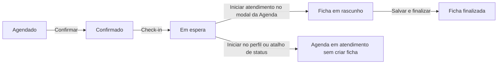

# Atendimento clínico: diagnóstico do fluxo e proposta de experiência

## Status da implementação — 26/09/2026

As seções de diagnóstico abaixo registram o comportamento encontrado antes da
correção. A implementação realizada a partir desta análise agora inclui:

- transição de status compatível com sessão de suporte, preservando usuário
  efetivo, ator original e metadados de impersonação;
- início clínico atômico e idempotente, com vínculo opcional ao agendamento,
  validação central de paciente, profissional, escopo e versão da ficha;
- seleção explícita da ficha pela Agenda e pelo perfil do paciente;
- início avulso pelo perfil sem criar agendamento artificial;
- continuidade visível para atendimentos em rascunho e uma fila própria em
  `/prontuario`;
- finalização clínica sincronizada com o estado operacional do agendamento;
- autosave com controle de concorrência, aviso de alterações pendentes e
  proteção de saída;
- erros junto aos campos obrigatórios, foco no primeiro erro, múltiplos
  diagnósticos e controle de diagnóstico principal;
- resumo clínico do paciente, adendos condicionados à permissão e horários no
  fuso da clínica;
- proteção contra perda de conteúdo ao trocar tipo ou modelo de documento.

### Revisão de interface após a implementação

A jornada clínica também recebeu uma passada de consistência visual e de
interação, cobrindo Agenda, perfil do paciente, Conversas, prontuário, fichas e
modelos de documentos:

| Antes                                                                               | Depois                                                                                                | Motivo                                                          |
| ----------------------------------------------------------------------------------- | ----------------------------------------------------------------------------------------------------- | --------------------------------------------------------------- |
| A conversa de WhatsApp e a consulta usavam o mesmo nome no menu                     | A caixa de entrada passou a se chamar **Conversas** e a consulta, **Atendimento clínico**             | Reduzir ambiguidade entre comunicação e cuidado clínico         |
| O perfil destacava **Editar paciente**                                              | **Iniciar atendimento** passou a ser a ação principal e editar ficou secundária                       | Priorizar a tarefa recorrente do profissional                   |
| Ações do agendamento ficavam no fim do conteúdo rolável                             | Ações passaram para o rodapé fixo do modal                                                            | Manter o próximo passo visível em telas menores e conteýo longo |
| Ficha e documentos apareciam como blocos longos consecutivos                        | O prontuário ganhou abas **Ficha do atendimento** e **Documentos**, mantendo o estado dos formulários | Melhorar a orientação sem perder o que foi digitado             |
| Paciente, profissional e agenda ocupavam três cartões altos                         | O contexto virou uma faixa compacta e responsiva                                                      | Reservar mais área para o registro clínico                      |
| Cancelar ou navegar para fora dos editores de modelos descartava mudanças sem aviso | Fichas e modelos de documentos confirmam o descarte antes de sair                                     | Evitar perda acidental de trabalho                              |
| Abas importantes da caixa de entrada e dos dados do contato dependiam de ícones     | Os nomes das abas passaram a ficar visíveis                                                           | Favorecer reconhecimento, leitura rápida e acessibilidade       |
| A ausência da integração mencionava configuração interna                            | O estado vazio explica o próximo passo e oferece **Configurar WhatsApp**                              | Transformar um estado sem saída em uma ação recuperável         |

Nesta passada não havia um navegador conectado ao ambiente para inspeção
visual. A revisão foi feita sobre os componentes e seus estados reais, com
validação de tipos, lint, testes e build. A conferência visual final continua
necessária no ambiente integrado, em larguras de desktop e celular.

A migration `20260926160000_unified_clinical_encounter_flow.sql` precisa ser
aplicada no Supabase antes de usar as novas actions. A validação local cobre
tipos, lint, testes existentes e build. A execução real das RPCs, a reprodução
da sessão de suporte e a jornada visual com uma conta Profissional vinculada
continuam dependendo do ambiente integrado.

## Escopo e evidências

Análise da Agenda, perfil e lista de pacientes, prontuário, modelos clínicos,
documentos, permissões, funções SQL, eventos de status e relação com o financeiro.
O relato investigado é a confirmação de um agendamento existente, com o perfil
visível de Administrador da clínica.

Foram realizadas leitura do código e das migrations, consultas somente de leitura
à API do Supabase configurada em `apps/web/.env.local` e execução dos testes
existentes de Agenda e formulários clínicos. Nenhum registro foi criado, confirmado,
finalizado ou excluído durante a investigação. Nenhuma regra da aplicação foi
alterada nesta etapa.

Limites: não há navegador conectado para percorrer as telas como médico. A URL
de conexão SQL direta não estava utilizável; portanto, a definição efetivamente
instalada das funções e a lista de migrations aplicadas não foram inspecionadas.
Os comportamentos das funções abaixo são os definidos no repositório. O erro
original do banco da tentativa mostrada na imagem ainda não foi capturado.

## 1. Respostas diretas

| Pergunta                                    | Comportamento atual                                                                                                                                                                                                                |
| ------------------------------------------- | ---------------------------------------------------------------------------------------------------------------------------------------------------------------------------------------------------------------------------------- |
| Precisa ter agendamento?                    | No caminho de criação disponível na interface, sim: o início clínico está no modal da Agenda. O banco e uma server action suportam atendimento sem agendamento, mas essa action não tem um formulário chamador na interface atual. |
| Posso iniciar pelo perfil do paciente?      | O perfil abre fichas existentes. Seu botão “Iniciar”, dentro do agendamento, só muda o status para `in_progress`; não cria nem abre a ficha.                                                                                       |
| Quais dados informo ao iniciar pela Agenda? | Nenhum campo novo. Paciente e profissional vêm do agendamento; a ficha é escolhida pelo sistema.                                                                                                                                   |
| Seleciono uma ficha?                        | Não. É usado o modelo ativo padrão da empresa; na ausência dele, o ativo mais antigo. Em seguida, sua versão mais recente.                                                                                                         |
| Qual ficha seria aberta hoje?               | Na configuração consultada, o padrão tem as quatro seções SOAP: Subjetivo, Objetivo, Avaliação e Plano.                                                                                                                            |
| Qual a data do atendimento?                 | `encounters.started_at` recebe `now()` no banco quando o registro é criado. Ao reabrir, esse horário é preservado.                                                                                                                 |
| Cria um agendamento para a hora do início?  | Não. O fluxo da Agenda vincula o compromisso já existente, sem mudar seu horário planejado. A função de atendimento avulso também não cria um compromisso.                                                                         |
| Finalizar a ficha finaliza o agendamento?   | Não nas funções atuais: salvar/finalizar altera o registro clínico; marcar “Atendido” é outra ação.                                                                                                                                |

### Conceitos que a interface precisa distinguir

- **Agendamento:** compromisso planejado, com horário, profissional, unidade,
  procedimento e informações operacionais.
- **Atendimento clínico:** uma ocorrência do cuidado, com paciente, profissional,
  início real, conteúdo registrado e finalização.
- **Prontuário do paciente:** o histórico longitudinal, que reúne vários
  atendimentos e documentos.
- **Modelo de ficha:** estrutura dos campos daquele atendimento, como SOAP ou
  uma anamnese específica. Não equivale ao procedimento cobrado.
- **Modelo de documento:** estrutura de receita, atestado, solicitação de exame
  ou declaração. É escolhido em outro momento, ao emitir o documento.

Esta separação conceitual é compatível com o FHIR: Appointment representa o
planejamento, enquanto Encounter representa a interação assistencial. A proposta
aqui usa essa distinção como referência de modelagem, sem afirmar conformidade
FHIR do projeto. [HL7 FHIR R5 — Encounter](https://hl7.org/fhir/R5/encounter.html).

## 2. Percurso atual pela Agenda

1. Abrir um agendamento `scheduled` e clicar em **Confirmar**.
2. Abrir o confirmado e clicar em **Check-in**. Isso muda para `waiting`.
3. Abrir o agendamento em espera com permissão de visualizar e preencher
   prontuários. Somente nessa combinação aparece **Iniciar atendimento**.
4. A action lê paciente e profissional, exige profissional ativo e verifica
   o vínculo com o usuário quando o acesso é restrito a prontuários próprios.
5. Se já existe atendimento para o compromisso, reutiliza seu identificador.
6. Caso contrário, escolhe modelo/versão e grava `encounters` em rascunho,
   seguido de `encounter_entries` com uma cópia da estrutura da ficha.
7. Tenta mudar a Agenda para `in_progress` e redireciona para `/prontuario/[id]`.



O backend de início aceita mais situações do que o botão permite: não valida
explicitamente o status permitido antes de criar a ficha. Já o botão exige
`waiting`. Essa divergência precisa ser resolvida em uma regra central.

### A falha de percurso mais importante

O perfil do paciente e alguns atalhos dos cards da Agenda oferecem **Iniciar**,
que chama apenas `changeAppointmentStatus`. Depois disso:

- o compromisso passa para `in_progress`;
- pode continuar sem registro em `encounters`;
- o modal da Agenda deixa de mostrar **Iniciar atendimento**, pois só o mostra
  para `waiting`;
- **Abrir prontuário** também não aparece quando não há ficha.

Assim, é possível avançar o andamento operacional e perder o caminho visível
para começar a documentação clínica.

## 3. O que o médico encontraria no prontuário

Esta descrição foi derivada dos componentes, sem validação visual no navegador.

1. Breadcrumb do paciente e botão de retorno à Agenda ou ao paciente.
2. Identificação do modelo/versão e selo **Rascunho** ou **Finalizado**.
3. Três cartões: paciente e nascimento; profissional e início; vínculo com Agenda.
4. Seções da ficha, dispostas verticalmente.
5. Um CID com descrição e um editor de notas livres.
6. Barra fixa inferior com estado de salvamento, **Salvar rascunho** e
   **Salvar e finalizar**.
7. Documentos clínicos, com escolha de tipo e modelo, título/conteúdo e emissão
   de PDF. As permissões de emissão são verificadas por tipo.
8. Depois de finalizada, a ficha fica bloqueada e há área de adendos.

### Configuração encontrada em leitura do banco

Há dois modelos ativos, sendo um padrão:

| Modelo identificado pela estrutura | Campos                                                                 | Obrigatoriedade                                                                                          |
| ---------------------------------- | ---------------------------------------------------------------------- | -------------------------------------------------------------------------------------------------------- |
| SOAP, padrão atual                 | Relato subjetivo, dados objetivos, avaliação clínica, plano de cuidado | Os quatro campos estão configurados como opcionais; a finalização exige algum conteúdo clínico ou notas. |
| Anamnese e avaliação               | Queixa principal, história da doença atual, exame físico, conduta      | Queixa principal e conduta são obrigatórias.                                                             |

O seletor automático não usa especialidade, procedimento, médico, primeira
consulta ou retorno. O cadastro de modelos envia `p_specialty_id: null`, e não
há escolha/troca de ficha no editor do atendimento.

### O que já está bem estruturado

- Snapshot e versionamento preservam a ficha usada em atendimentos antigos.
- Há salvamento manual de rascunho e sinalização de mudanças pendentes.
- Existe proteção de saída para links internos e fechamento/recarregamento.
- Salvar e finalizar usa uma RPC transacional: uma falha de validação reverte
  a operação inteira.
- Há validação dos tipos de campos e obrigatoriedade na finalização.
- Fichas finalizadas são protegidas contra edição; correções usam adendos.
- Há índice único para impedir dois atendimentos ligados ao mesmo agendamento.

## 4. Permissões e preparação para uso por médicos

O perfil Profissional originalmente recebe visualização da Agenda e permissões
clínicas próprias. Não recebe `agenda.editar_agendamento` por padrão.

Entretanto, `markAppointmentInProgressIfPossible` exige essa permissão. Sem ela,
retorna silenciosamente; se a RPC falhar, também retorna sem propagar o erro.
Logo, um médico pode criar a ficha e continuar aparecendo “Em espera” na Agenda.

Não recomendo conceder edição completa da Agenda apenas para corrigir isso.
Iniciar e encerrar o próprio atendimento devem permitir a atualização operacional
correspondente dentro da mesma operação clínica, com escopo validado.

### Evidência do ambiente consultado

| Verificação                                           | Resultado                                                       |
| ----------------------------------------------------- | --------------------------------------------------------------- |
| Profissionais ativos                                  | 5                                                               |
| Profissionais ativos vinculados a um usuário de login | 0                                                               |
| Modelos clínicos ativos                               | 2                                                               |
| Modelo ativo padrão                                   | 1                                                               |
| Registros clínicos                                    | 5: dois finalizados sem agendamento e três rascunhos vinculados |
| Status dos agendamentos dos três rascunhos            | Dois confirmados e um em espera                                 |
| Agendamentos em `in_progress` sem ficha               | 32                                                              |
| Sessões de suporte ativas na janela de quatro horas   | 1                                                               |

Esses números descrevem o projeto configurado localmente, sem conteúdo de
prontuários ou identificação dos pacientes. Existem scripts de dados demonstrativos
que criam status e fichas diretamente; portanto, as contagens não provam que
todos esses casos foram produzidos por cliques com defeito.

A ausência de vínculo `professionals.user_id` impede um teste real do acesso
restrito do médico. A conta administrativa da sessão de suporte consultada tem
permissões de visualizar, preencher e finalizar fichas. Testar só por ela não
valida as restrições e a experiência do profissional.

## 5. Erro ao confirmar agendamento existente

### O que foi confirmado

A mensagem da imagem é produzida em `agenda/actions.ts` quando `friendlyError`
encontra “foreign key” em uma mensagem não reconhecida pelos casos anteriores.
O texto fala de “solicitação” mesmo quando a ação é sobre um agendamento existente.

O percurso é:

```text
Confirmar
  → changeAppointmentStatus
  → transition_appointment_status
  → UPDATE appointments
  → trigger register_appointment_status_change
  → INSERT appointment_status_events
  → demais efeitos e auditoria
```

O erro significa falha de um vínculo exigido pelo banco. A tradução atual não
permite saber qual vínculo e descarta, nessa camada, os detalhes da resposta.
Não há logging específico da falha nesse handler.

### Hipótese principal: autoria durante sessão de suporte

1. A camada web resolve ator real e usuário efetivo da clínica em
   `getRequestContext`.
2. `changeAppointmentStatus` chama uma RPC que não recebe a sessão de suporte.
3. O trigger usa `current_app_user_id()`, que resolve o usuário do `auth.uid()`
   original, não o usuário efetivo mostrado na clínica.
4. `appointment_status_events` exige que `(organization_id, actor_user_id)`
   exista em `app_users` para a mesma organização.
5. Um superadministrador externo à clínica não satisfaz esse vínculo composto.

Foi encontrada uma sessão de suporte ativa em que o ator original pertence a
outro contexto organizacional. Isso torna essa hipótese particularmente relevante,
mesmo quando o cabeçalho da aplicação exibe Administrador da clínica.

**Ainda não é uma reprodução comprovada da tentativa da imagem.** Para uma conta
administrativa autenticada diretamente e pertencente à organização, essa causa
específica não deveria ocorrer. É necessário capturar o código e o nome da
constraint do erro original para fechar o diagnóstico, inclusive sobre possíveis
diferenças entre migrations locais e banco remoto.

### Correção técnica proposta

- Usar um contrato de transição com contexto efetivo explícito, validando sessão,
  organização, permissões e recurso da Agenda dentro da transação.
- Manter o usuário efetivo da clínica no vínculo operacional e registrar o ator
  original e a sessão de suporte na auditoria apropriada.
- Não resolver o erro apagando a foreign key, usando um usuário arbitrário ou
  transformando a ação em uma atualização irrestrita com service role.
- Registrar código, constraint identificada, operação e identificador de correlação
  no servidor; excluir textos clínicos, tokens e dados pessoais desses logs.
- Mostrar mensagem específica e contextual, como “Não foi possível registrar a
  confirmação nesta sessão. Reabra o acesso à clínica e tente novamente”, quando
  a falha de sessão for identificada. Não sugerir novo cadastro de paciente.

## 6. Revisão de UI e UX

As propostas priorizam consistência de ações, visibilidade do estado e recuperação
de erros. São aplicações ao projeto das
[heurísticas de usabilidade da Nielsen Norman Group](https://www.nngroup.com/articles/ten-usability-heuristics/).

| Before                                                                                | After                                                                                                           | Why                                                                                 |
| ------------------------------------------------------------------------------------- | --------------------------------------------------------------------------------------------------------------- | ----------------------------------------------------------------------------------- |
| “Iniciar” muda só a Agenda em alguns lugares; em outro cria a ficha                   | Uma ação clínica compartilhada: “Iniciar atendimento” ou “Continuar atendimento”                                | O mesmo nome precisa produzir o mesmo resultado.                                    |
| Início clínico só aparece em espera                                                   | Permitir recuperação de `in_progress` sem ficha e explicitar os pré-requisitos dos outros estados               | Evitar um percurso sem saída.                                                       |
| Perfil do paciente sem início clínico avulso                                          | Ação principal “Iniciar atendimento”, com contexto já preenchido                                                | Atender quem chega sem agendamento não deve exigir criar um compromisso artificial. |
| Modelo escolhido silenciosamente                                                      | Exibir “Ficha: SOAP” e opção de trocar antes de iniciar                                                         | O médico sabe qual estrutura está usando.                                           |
| Médico depende de permissão administrativa para atualizar o próprio andamento         | Transição operacional incorporada ao início/finalização clínica autorizada                                      | Reduzir inconsistências sem ampliar acesso administrativo.                          |
| “Finalizar” na Agenda e “Salvar e finalizar” no prontuário têm efeitos independentes  | “Finalizar atendimento” conclui ficha e andamento; encerramento operacional excepcional deve ter nome explícito | Impedir que “Atendido” seja interpretado como documentação clínica concluída.       |
| Longo modal de Agenda destaca CPF, contato, preço e pagamento antes do acesso clínico | Visão do médico com identidade, horário, motivo/procedimento, ficha e ação principal                            | Reduzir os passos recorrentes do atendimento.                                       |
| Tela do prontuário não carrega resumo longitudinal, alergias ou medicações            | Cabeçalho persistente do paciente e histórico/resumo consultável ao lado                                        | Evitar sair do editor para recuperar contexto.                                      |
| Apenas salvamento manual                                                              | Autosave de rascunho com estados “Salvando”, “Salvo às…” e “Falha ao salvar”; manter ação manual                | Reduzir dependência de memória e tornar falhas visíveis.                            |
| Adendo é mostrado a todo leitor de ficha finalizada                                   | Mostrar edição de adendo apenas com a permissão correspondente                                                  | Evitar oferecer uma ação que o servidor recusará.                                   |
| Campos da ficha usam texto em `div` como rótulo                                       | Labels associados, erros por campo e foco no primeiro erro                                                      | Melhorar navegação por teclado e leitura assistida.                                 |
| “Atendimento” também nomeia a conversa de WhatsApp                                    | Diferenciar “Conversas” e “Atendimento clínico” nos pontos ambíguos                                             | Evitar confundir iniciar conversa com iniciar consulta.                             |

### Pontos técnicos adicionais

- A criação pela Agenda usa service role e duas inserções separadas. A RPC
  `create_clinical_encounter` já é atômica, mas não é usada nesse caminho.
  O tratamento de duplicidade pode redirecionar uma segunda chamada antes de a
  primeira terminar de criar a entrada. Centralizar em uma RPC idempotente.
- A regra do backend deve validar também estado do agendamento, paciente
  elegível, profissional, organização, escopo e versão da ficha. A condição do
  botão não é uma garantia para a operação.
- O salvamento do rascunho não usa revisão esperada. Duas abas podem sobrescrever
  conteúdo uma da outra. Autosave deve vir acompanhado de controle de concorrência.
- A proteção de saída atual trata links e `beforeunload`, sem tratamento explícito
  de Voltar/Avançar dentro da SPA. Precisa de teste no navegador.
- Há apenas um CID editável; a action salva um array de um diagnóstico e a RPC
  substitui todos os diagnósticos. Isso não preserva múltiplos diagnósticos caso
  existam por outros caminhos.
- A ficha e os documentos usam `Intl.DateTimeFormat` sem `timeZone` explícito em
  algumas apresentações, embora a página carregue o fuso da clínica. Padronizar
  o fuso do horário real e manter o horário planejado separado.
- Se não houver modelo ativo/publicado, o início falha com um toast e não oferece
  um caminho contextual para configurar uma ficha ou pedir acesso.
- Emissão de documentos possui formulário próprio. Trocar o modelo substitui
  o texto sem confirmação, e suas edições não participam do estado `dirty` do
  editor clínico. Proteger conteúdo alterado antes de troca/saída.

## 7. Fluxo recomendado

### Com agendamento

1. Médico abre sua Agenda/área do dia ou o perfil do paciente.
2. Clica em **Iniciar atendimento**. Paciente, profissional, procedimento e
   agendamento já vêm definidos.
3. Um início compacto mostra paciente, profissional e **Ficha: SOAP**, com troca
   opcional. Se houver ficha em aberto para o compromisso, a ação vira
   **Continuar atendimento**.
4. Uma única operação grava ficha, início real e status operacional. Falha em
   qualquer parte não deixa registros parciais.
5. O editor abre com identidade e contexto clínico sempre acessíveis.
6. **Finalizar atendimento** valida, salva, bloqueia a ficha e conclui o andamento
   correspondente. Exibe confirmação de conclusão e retorno à lista do dia.

Chegada e consulta são eventos distintos: check-in registra chegada; início
clínico registra o início real. Caso se permita iniciar a partir de confirmado,
o sistema deve explicitar a chegada ainda não registrada, sem inventar um
horário de chegada retroativo.

### Sem agendamento

No perfil do paciente, **Iniciar atendimento** deve permitir:

| Informação           | Proposta                                                                                                                             |
| -------------------- | ------------------------------------------------------------------------------------------------------------------------------------ |
| Paciente             | Já preenchido pelo perfil.                                                                                                           |
| Profissional         | Médico logado, pelo vínculo com seu cadastro; seleção apenas quando o usuário pode atuar por outros profissionais.                   |
| Ficha                | Padrão pré-selecionado e claramente visível, com troca.                                                                              |
| Início               | Agora, no fuso da clínica; usar o horário do servidor ao confirmar. Registro retroativo, se necessário, deve ser um fluxo explícito. |
| Agendamento          | Opcional. Sugerir compromissos compatíveis do paciente para evitar duplicidade, sem vínculo silencioso.                              |
| Unidade/procedimento | Herdados quando houver compromisso; coletados quando necessários ao contexto operacional/cobrança do atendimento avulso.             |

**Recomendação: não criar automaticamente um agendamento fictício.** Registrar o
atendimento avulso e exibi-lo na atividade do dia. Se for necessário ocupar horário
na Agenda, oferecer uma ação explícita de encaixe e validar conflitos.

Há uma dependência a tratar: hoje a criação do compromisso dispara a geração da
conta a receber, segundo as regras financeiras aplicáveis. A função de atendimento
avulso não passa por esse fluxo. Portanto, abrir atendimento sem agendamento exige
definir também como registrar o procedimento/cobrança, sem duplicar lançamentos
e sem confundir consulta iniciada com pagamento recebido.

### Escolha da ficha

- No MVP, um padrão por clínica mais escolha explícita resolve a lacuna principal.
- Depois, adicionar preferência por profissional, especialidade ou procedimento
  somente onde houver uma necessidade real.
- A escolha deve ocorrer antes da primeira gravação clínica; uma troca posterior
  precisa preservar os dados e avisar sobre incompatibilidades.
- Manter o snapshot versionado já existente.
- Se existir apenas uma ficha adequada, apresentar seu nome sem impor um seletor
  obrigatório adicional.

## 8. Ordem de implementação

### Prioridade 0 — desbloquear e diagnosticar

1. Capturar a constraint da confirmação e corrigir a autoria/contexto efetivo
   se a hipótese for confirmada no ambiente.
2. Centralizar o início e a retomada da ficha; cobrir `in_progress` sem prontuário.
3. Preparar uma conta Profissional de teste vinculada ao seu cadastro, com dados
   demonstrativos e escopo conhecido.

### Prioridade 1 — alinhar o fluxo inteiro

4. Contrato transacional e idempotente de início, usado em todos os atalhos.
5. Ficha visível/selecionável e início avulso no perfil do paciente.
6. Finalização clínica e andamento operacional coerentes, com política explícita
   para eventual encerramento operacional com documentação pendente.
7. Contexto do paciente e histórico acessíveis durante o preenchimento.
8. Autosave com controle de concorrência e recuperação de falhas.

### Prioridade 2 — acabamento e produtividade

9. Melhorar labels, mensagens por campo, foco, adendos e fuso horário.
10. Proteger rascunhos dos documentos; considerar múltiplos diagnósticos.
11. Evoluir uma área “Meus atendimentos” com em espera, em curso e pendentes de
    documentação, quando o fluxo básico já estiver consistente.

## 9. Validação necessária antes de considerar o fluxo pronto

| Cenário                                             | Resultado esperado                                                             |
| --------------------------------------------------- | ------------------------------------------------------------------------------ |
| Administrador direto confirma agendamento existente | Confirmação e autoria corretas, sem falha de FK.                               |
| Suporte acessa como administrador e confirma        | Usuário efetivo e ator original preservados nos locais apropriados.            |
| Médico vinculado inicia o próprio agendamento       | Ficha e andamento coerentes sem conceder edição geral de Agenda.               |
| Médico tenta iniciar consulta de outro profissional | Recusa explícita conforme escopo, no servidor.                                 |
| Paciente em espera, clique duplo ou duas abas       | Um atendimento completo, sem entrada órfã.                                     |
| Compromisso em atendimento sem ficha                | Caminho claro para abrir/criar a ficha; sem travar o percurso.                 |
| Atendimento avulso                                  | Horário real correto, sem compromisso/cobrança duplicados.                     |
| Ficha ausente, arquivada ou sem versão              | Mensagem acionável e nenhum registro parcial.                                  |
| Consulta com histórico existente                    | Reabrir registro correto; nunca reutilizar silenciosamente outra consulta.     |
| Cancelado, falta, paciente excluído/inativo/óbito   | Política explícita para novo atendimento e preservação do histórico existente. |
| Rascunho, perda de rede e duas abas editando        | Conteúdo preservado; conflito/falha visíveis.                                  |
| Campos obrigatórios vazios                          | Erros junto aos campos e foco no primeiro; sem finalização parcial.            |
| Finalização                                         | Conteúdo salvo, ficha bloqueada e andamento coerente.                          |
| Leitor sem permissão de adendo                      | Consulta liberada; escrita não oferecida.                                      |
| Navegação, teclado e tela estreita                  | Identidade do paciente visível e ações alcançáveis, sem perda de conteúdo.     |

Os seis arquivos de testes de Agenda e biblioteca clínica passaram: **35
testes**. Depois da implementação, a suíte completa também passou: **18 arquivos
e 129 testes**. Eles cobrem regras TypeScript, mas não equivalem a teste de
integração das novas RPCs ou à jornada visual do médico.

## 10. Mapa de evidências no código

| Arquivo                                                                           | O que fundamenta                                                                                                           |
| --------------------------------------------------------------------------------- | -------------------------------------------------------------------------------------------------------------------------- |
| `apps/web/src/app/(app)/agenda/actions.ts`                                        | Confirmação, tradução genérica do erro, criação da ficha, seleção automática do modelo e atualização silenciosa de status. |
| `apps/web/src/app/(app)/agenda/agenda-board.tsx`                                  | Condição `waiting`, formulário de início e atalhos que só mudam status.                                                    |
| `apps/web/src/app/(app)/agenda/page.tsx`                                          | Permissões passadas à interface da Agenda.                                                                                 |
| `apps/web/src/app/(app)/pacientes/[id]/patient-appointment-actions.tsx`           | “Iniciar” e “Finalizar” operacionais no perfil.                                                                            |
| `apps/web/src/app/(app)/pacientes/[id]/page.tsx`                                  | Histórico, acesso às fichas existentes e ausência do início clínico direto.                                                |
| `apps/web/src/app/(app)/prontuario/page.tsx`                                      | Redirecionamento da antiga entrada de prontuários para pacientes.                                                          |
| `apps/web/src/app/(app)/prontuario/actions.ts`                                    | Action avulsa sem chamador, salvamento, finalização e documentos.                                                          |
| `apps/web/src/app/(app)/prontuario/[id]/page.tsx`                                 | Composição da tela clínica e formatos de data.                                                                             |
| `apps/web/src/app/(app)/prontuario/[id]/encounter-editor.tsx`                     | Campos, salvamento manual, proteção de saída, finalização e adendos.                                                       |
| `apps/web/src/app/(app)/prontuario/[id]/document-panel.tsx`                       | Seletor de modelos de documento e emissão independente.                                                                    |
| `apps/web/src/components/clinical/clinical-form-renderer.tsx`                     | Campos estruturados e associação de rótulos.                                                                               |
| `apps/web/src/lib/auth/context.ts`                                                | Ator real, usuário efetivo e organização em sessão de suporte.                                                             |
| `supabase/migrations/20260622200000_phase6_internal_schedule.sql`                 | FK composta do autor no histórico e trigger de transição.                                                                  |
| `supabase/migrations/20260622210000_phase7_clinical_records.sql`                  | Atendimento avulso, horário real, snapshot, índice único, permissões e imutabilidade.                                      |
| `supabase/migrations/20260718180000_agenda_resource_scope_rls.sql`                | Contrato atual de transição e escopo de recursos da Agenda.                                                                |
| `supabase/migrations/20260714180000_advanced_clinical_and_document_templates.sql` | Contexto efetivo, validação/finalização transacional e modelos.                                                            |
| `supabase/migrations/20260622230000_phase9_operational_finance.sql`               | Integração de cobrança disparada pelo agendamento.                                                                         |
| `scripts/seed-demo-agenda.mjs` e `scripts/seed-demo-clinical.mjs`                 | Dados demonstrativos podem conter estados produzidos diretamente.                                                          |
